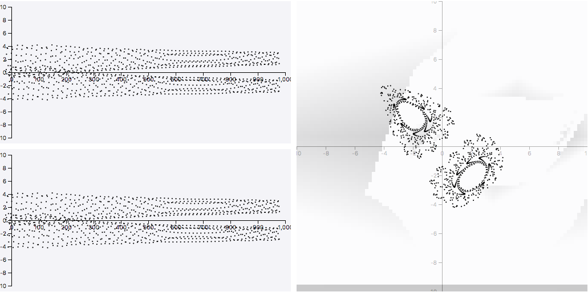

# Henon-Map
[Wikipedia:](https://en.wikipedia.org/wiki/H%C3%A9non_map)
>The **Hénon map** is a discrete-time dynamical system. It is one of the most studied examples of dynamical systems that exhibit chaotic behavior. The Hénon map takes a point (xn, yn) in the plane and maps it to a new point.

// TODO: тут типа про ab-XY-controller в новой версии controlls
- описать своими словами без википедии и формулы мб почуть поменять (x(n-1), а не x(n+1))
Most areas of the map are boring. So there is a map of "coolness" in the background. It  highlights some interesting areas and it can help you to explore the original Henon Map plot.

This coolness-map was drawn by empiric "coolness formula". 

